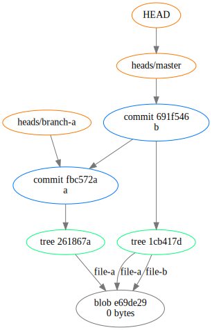
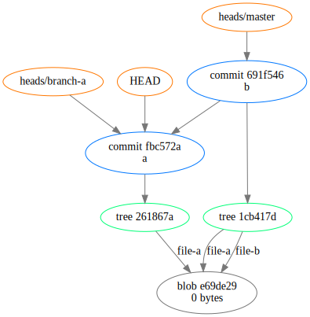

# [pylineprof]

Proof of concept line by line python profiler.
It naively rewrites the input file by inserting begin and end statements around every line.
Simple statements (`x = a + b`) have a large 3x overhead,
but overal it gives a good idea where performance issues are located.

Requires Python 3.5.

## Usage

`./lineprof.py /script/to/profile.py`

## Example

## Dependencies

* astunparse (optional)

# [git-dot]

Export all the objects in a git repository in DOT format.

## Usage

    git dot [--show] [--commits] [--trees] [--refs] [--heads]

            --show      do not write to stdout; render to temporary file as svg
                        and show using default viewer
    
        turn on filtering and enable: (multiple allowed)
            --commits   commit objects
            --trees     commit objects and tree objects
            --refs      refs ($GIT_DIR/refs)
            --heads     heads ($GIT_DIR/*HEAD)

## Installation

    $ install git-dot /usr/bin

## Example

    $ touch file-a file-b
    $ git init
    $ git add file-a && git commit -m a
    $ git branch branch-a
    $ git add file-b && git commit -m b
    $ git dot --show

### Visualizing detached HEAD state

    $ git checkout HEAD^
    ...
    You are in 'detached HEAD' state.
    ...
    $ git dot --show

